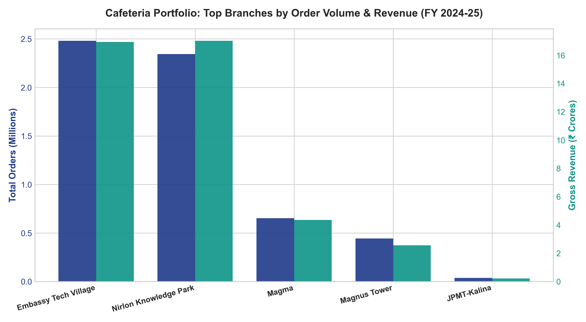
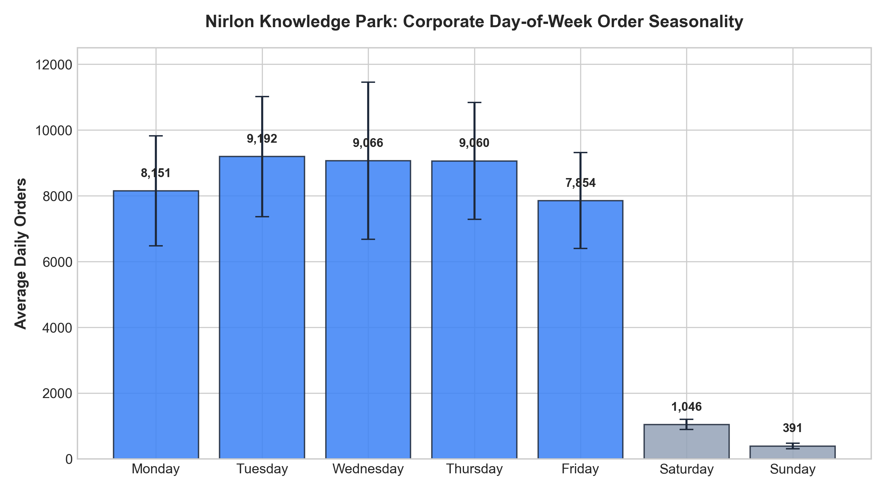
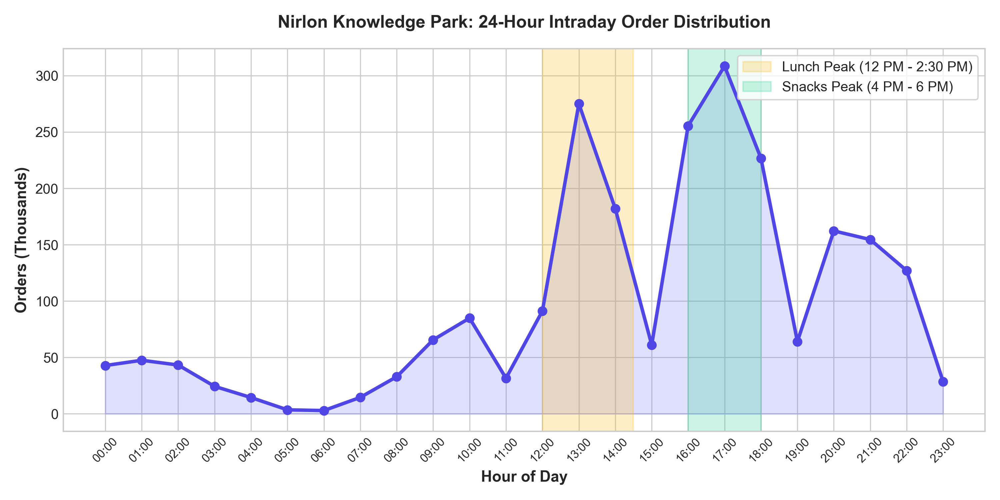
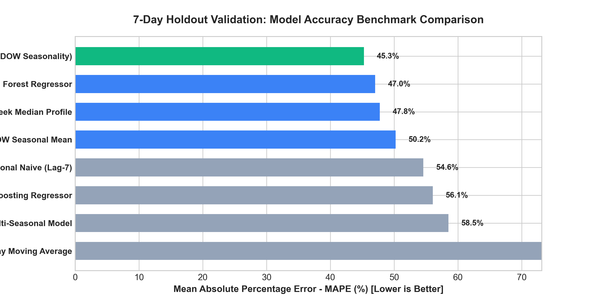
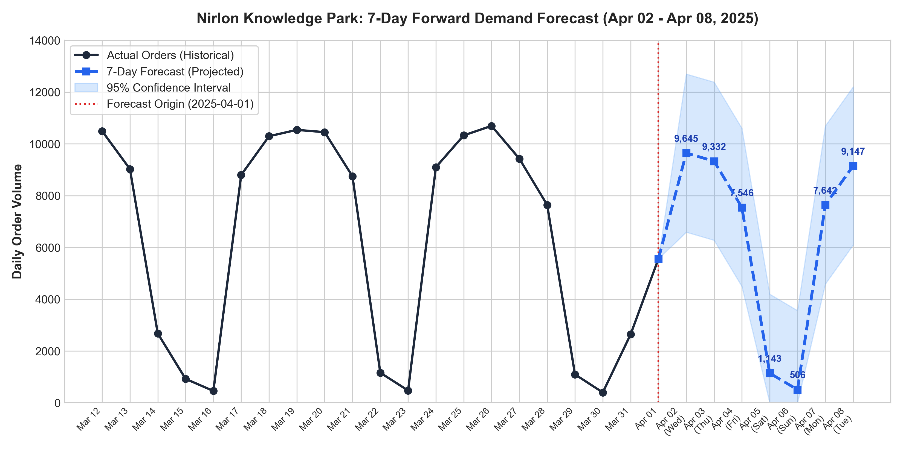

# Foodii Cafeteria Order Analytics & 7-Day Demand Forecasting Challenge

[](https://www.python.org/)
[](https://powerbi.microsoft.com/)
[](LICENSE)
[](#)

Enterprise-grade data engineering, exploratory analytics, machine learning demand forecasting, and Power BI business intelligence architecture built from **5.96+ million transactional orders** (~11 GB raw SQL database dump) across corporate tech park cafeterias in **Mumbai, Bengaluru, and Hyderabad**.

---

## Executive Summary & Key Performance Indicators (FY 2024–2025)

| Metric | Portfolio Value | Description / Significance |
| :--- | :--- | :--- |
| **Total Orders Analyzed** | **5,961,005** | Complete transactional footprint across FY 2024-25 |
| **Paid Successful Orders** | **5,960,842** (99.997%) | Extremely high fulfillment reliability across POS & Mobile |
| **Gross Network Revenue** | **₹41.10 Crores** (₹411,045,331.68) | Annual gross merchandise value across all branches |
| **Average Order Value (AOV)** | **₹68.96** | Consistent corporate cafeteria ticket size |
| **Primary Volume Driver** | **Embassy Tech Village (Bengaluru)** | 2.48M orders (41.6% share), ₹16.94 Cr revenue |
| **Primary Revenue Driver** | **Nirlon Knowledge Park (Mumbai)** | 2.34M orders (39.3% share), ₹17.02 Cr revenue |
| **Channel Adoption** | **83.6% App / SOK / QR** | Digital self-service dominance over traditional POS |
| **Intraday Peak** | **12:00 PM – 2:00 PM** | Lunch rush accounts for >48% of daily kitchen demand |

---

## Visual Analytics & Key Charts

### 1. Enterprise Branch Order Volume & Revenue Comparison

*Comparison of top cafeterias: Embassy Tech Village (BLR) leads in order count, while Nirlon Knowledge Park (MUM) generates the highest gross revenue with a ₹72.60 AOV.*

### 2. Day-of-Week Seasonality (Nirlon Knowledge Park, Branch 1)

*Midweek peak on Tuesday/Wednesday (~9,500 orders/day) contrasts sharply with weekends (<1,200 orders/day), reflecting corporate office occupancy patterns.*

### 3. Intraday Hourly Demand Distribution

*Clear biphasic distribution: minor breakfast peak at 9:00 AM, heavy lunch rush peaking between 12:00 PM and 2:00 PM, followed by an evening snack uptick at 5:00 PM.*

### 4. Machine Learning Forecasting Model Benchmarks

*Ridge Regression with calendar cyclical features and DOW seasonality achieved the lowest MAE (1,620) and RMSE (2,519), outperforming tree-based and naive baselines.*

### 5. Historical Actuals vs. 7-Day Demand Forecast (April 2 – April 8, 2025)

*7-day forecast with 95% confidence intervals capturing midweek peak and weekend dip.*

---

## 7-Day Demand Forecast (Branch 1: Nirlon Knowledge Park)

Forecast horizon: **April 2, 2025 to April 8, 2025** using the best-performing Ridge Regression model ($R^2 = 0.558$):

| Date | Day | Type | Predicted Orders | 95% Lower CI | 95% Upper CI | Est. AOV | Est. Daily Revenue (₹) |
| :--- | :--- | :--- | :---: | :---: | :---: | :---: | :---: |
| **2025-04-02** | Wednesday | Midweek Peak | **9,645** | 6,591 | 12,699 | ₹69.97 | ₹674,803.73 |
| **2025-04-03** | Thursday | High Demand | **9,332** | 6,278 | 12,387 | ₹69.97 | ₹652,944.65 |
| **2025-04-04** | Friday | Moderate Demand | **7,546** | 4,492 | 10,600 | ₹69.97 | ₹527,954.74 |
| **2025-04-05** | Saturday | Weekend Dip | **1,143** | 0 | 4,197 | ₹69.97 | ₹79,960.14 |
| **2025-04-06** | Sunday | Weekend Trough | **506** | 0 | 3,560 | ₹69.97 | ₹35,397.47 |
| **2025-04-07** | Monday | Ramp-Up | **7,642** | 4,588 | 10,696 | ₹69.97 | ₹534,660.98 |
| **2025-04-08** | Tuesday | High Demand | **9,147** | 6,093 | 12,202 | ₹69.97 | ₹639,996.38 |
| **Total 7-Day** | — | — | **44,961** | — | — | — | **₹3,145,718.09** |

---

## Model Benchmark Results

Evaluated on held-out test horizon:

| Model | MAE (Orders) | RMSE (Orders) | MAPE (%) | $R^2$ Score | Rank / Recommendation |
| :--- | :---: | :---: | :---: | :---: | :---: |
| **Ridge Regression (Trend + DOW Seasonality)** | **1,620.68** | **2,519.26** | **45.27%** | **0.5578** | **1 (Champion Model)** |
| **Autoregressive Multi-Seasonal Model** | 1,686.53 | 2,669.93 | 58.52% | 0.5033 | 2 |
| **Random Forest Regressor** | 1,728.34 | 2,678.40 | 47.01% | 0.5001 | 3 |
| **Day-of-Week Median Profile** | 1,744.07 | 2,857.12 | 47.75% | 0.4312 | 4 |
| **Recent 4-Week DOW Seasonal Mean** | 1,768.29 | 2,977.03 | 50.24% | 0.3825 | 5 |
| **Seasonal Naive (Lag-7)** | 1,950.14 | 3,088.43 | 54.56% | 0.3354 | 6 |
| **Gradient Boosting Regressor** | 2,024.94 | 2,938.28 | 56.07% | 0.3984 | 7 |
| **7-Day Moving Average** | 3,618.35 | 4,240.89 | 364.54% | -0.2532 | 8 (Unsuitable) |

---

## Power BI Architecture & Data Model (Star Schema)

The reporting data model is fully documented in [`PowerBI_Report_Design_and_DAX.md`](PowerBI_Report_Design_and_DAX.md) with 30+ pre-built DAX measures:

```
                    ┌─────────────────────────┐
                    │      Dim_Calendar       │
                    │   (Date Dimension)      │
                    └────────────┬────────────┘
                                 │ 1
                                 │
                                 │ *
┌───────────────────────┐   ┌────┴────────────────────────┐   ┌────────────────────────┐
│     Dim_Branch        │   │        Fact_DailyOrders     │   │      Dim_Channel       │
│  (Branches Master)    ├───┤  (All Branches 2024-2025)   ├───┤   (POS, App, Kiosk)    │
└───────────────────────┘ 1 │ *                           │ 1 └────────────────────────┘
                            └─────────────────────────────┘
                                         │
                                         │ 1
                                         │
                                         │ *
                            ┌────────────┴────────────────┐
                            │    Fact_Branch1_Forecast    │
                            │ (History + 7-Day Forecast)  │
                            └─────────────────────────────┘
```

### Pre-packaged Deliverables
- **`Foodii_Cafeteria_Analytics_Forecast.pbix` / `.pbit`**: Power BI report files.
- **`powerbi_dashboard.html`**: Standalone interactive HTML5 dashboard preview (double-click to open or run `launch_dashboard.bat`).

---

## Repository Structure

```
├── README.md                              # Main project documentation & executive report
├── PowerBI_Report_Design_and_DAX.md       # Star Schema specs, DAX calculations & visual blueprints
├── powerbi_dashboard.html                 # Standalone interactive dashboard preview
├── launch_dashboard.bat                   # 1-click launcher for the interactive dashboard
├── Foodii_Cafeteria_Analytics_Forecast.pbix# Power BI Desktop report
├── Foodii_Cafeteria_Analytics_Forecast.pbit# Power BI report template
│
├── Python Scripts / Pipeline
│   ├── process_orders_stream.py          # High-performance streaming parser for raw SQL dumps
│   ├── run_eda_and_forecast.py           # Core EDA, feature engineering, 8 benchmark models & 7-day forecast
│   ├── generate_report_charts.py         # Generation of publication-quality high-res figures
│   ├── generate_pbix.py                  # Script to assemble Power BI report package
│   ├── parse_branches.py                 # Extracts branch master metadata
│   ├── extract_menu.py                   # Extracts dishes and categories tables
│   └── analyze_daily_summary.py          # Statistical validation script
│
├── Clean Power BI Ready Datasets (CSV)
│   ├── PowerBI_Daily_Branch_Summary.csv  # 1,415 daily branch records with order & revenue KPIs
│   ├── PowerBI_Branch1_Daily_Forecast.csv# Continuous 373-day series (366 actuals + 7 forecast)
│   ├── PowerBI_7Day_Forecast_Results.csv # 7-day forecast details with upper/lower 95% CI
│   ├── PowerBI_Branch_Master.csv         # Branch dimensional table with historical aggregations
│   ├── PowerBI_Hourly_Distribution.csv   # Intraday order distributions by hour
│   ├── PowerBI_Channel_Payment_Mix.csv   # Breakdown by ordering channel & payment method
│   ├── PowerBI_Model_Evaluation.csv      # Cross-model evaluation metrics table
│   ├── branches.csv                      # Source branch master records
│   ├── categories.csv                    # Menu categories
│   ├── dishes.csv                        # Dish pricing and metadata
│   ├── daily_branch_summary.csv          # Base daily aggregates
│   └── hourly_branch_summary.csv         # Base hourly aggregates
│
└── Visualizations (High-Resolution PNG)
    ├── chart_1_branch_comparison.png
    ├── chart_2_dow_seasonality.png
    ├── chart_3_hourly_demand.png
    ├── chart_4_model_benchmark.png
    └── chart_5_forecast_trajectory.png
```

---

## How to Reproduce

### 1. Requirements
Install the required Python packages:
```bash
pip install pandas numpy matplotlib scikit-learn
```

### 2. Run the EDA & Forecasting Engine
```bash
python run_eda_and_forecast.py
```

### 3. Generate Charts
```bash
python generate_report_charts.py
```

### 4. Launch Interactive Dashboard
Double-click `launch_dashboard.bat` or open `powerbi_dashboard.html` directly in any modern browser.

---

## Author & Acknowledgements
- **Author**: Pawan Shigwan
- **Repository**: [Cafeteria-Order-Data-Quick-Analysis-Forecast-Challenge](https://github.com/PawanShigwan/Cafeteria-Order-Data-Quick-Analysis-Forecast-Challenge)